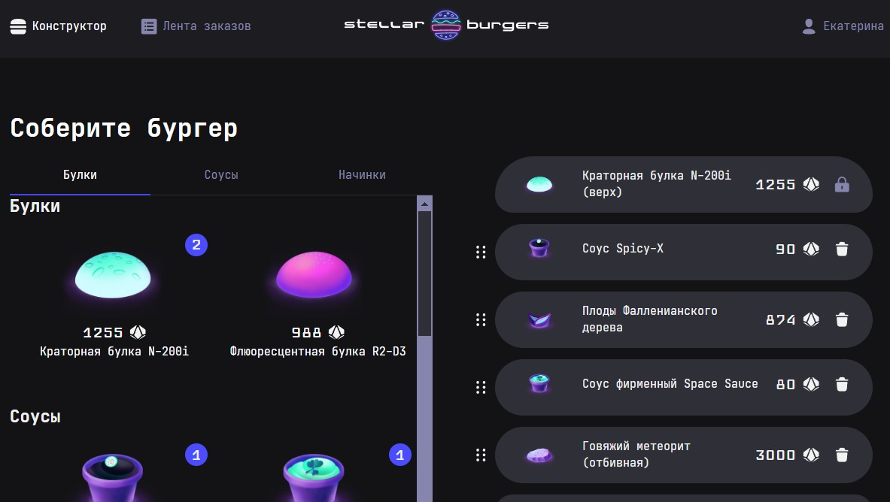

# 🍔Stellar Burger👽 -  🌟Создай свой звёздный бургер!🌟

Проект представляет собой одностраничное не адаптивное веб-приложение для создания и заказа бургеров. Пользователи могут
выбирать ингредиенты из списка, перетаскивать их в конструктор бургера, просматривать детали ингредиентов и заказов, а
также регистрироваться, авторизовываться, восстанавливать пароль и управлять своим профилем.

### Ссылки
[Готовый проект на gh-pages](https://gudrum1983.github.io/react-stellar-burger/)
| [Макет в Figma](https://www.figma.com/file/ocw9a6hNGeAejl4F3G9fp8/React-_-%D0%9F%D1%80%D0%BE%D0%B5%D0%BA%D1%82%D0%BD%D1%8B%D0%B5-%D0%B7%D0%B0%D0%B4%D0%B0%D1%87%D0%B8-(3-%D0%BC%D0%B5%D1%81%D1%8F%D1%86%D0%B0)_external_link?node-id=6291:2799)




## Что сделала

__1 этап - Организация и начальная верстка__
<details>
<summary>Организовала инфраструктуру проекта:</summary>

- [x] Создала новый проект и установила дополнительные пакеты.
- [x] Инициализировала git-репозиторий.

</details>
<details>
<summary>Выполнила layout главной страницы:</summary>

- [x] AppHeader — шапка приложения.
- [x] BurgerIngredients — список ингредиентов.
- [x] BurgerConstructor — текущий состав бургера.
- [x] Организовала проверки типов данных с использованием propTypes.

</details>

__2 этап - Redux и React DND__
<details>
<summary>Обновила инфраструктуру приложения для интеграции Redux и react-dnd:</summary>

- [x] Установила необходимые пакеты для Redux-хранилища и DnD.
- [x] Изменила структуру приложения для использования Redux.

</details>
<details>
<summary>Подготовила хранилище Redux:</summary>

- [x] Подготовила начальное состояние и создала редьюсеры.
- [x] Подключила хранилище к приложению.

</details>
<details>
<summary>Создала первые экшены и редьюсеры:</summary>

- [x] Описала функциональность для работы с ингредиентами и заказами.
- [x] Использовала redux-thunk для асинхронных действий.

</details>
<details>
<summary>Настроила навигацию по ингредиентам с помощью react-intersection-observer:</summary>

- [x] Создала переключатели в BurgerIngredients для навигации с подсветкой по текущей группе ингредиентов.

</details>
<details>
<summary>Реализовала сортировку и перетаскивание ингредиентов с помощью react-dnd:</summary>

- [x] Реализовала перетаскивание ингредиентов из BurgerIngredients в BurgerConstructor с изменением счетчика и динамическим расчётом стоимости бургера.
- [x] Реализовала перетаскивание ингредиентов внутри BurgerConstructor.

</details>
<details>
<summary>Взаимодействовала с API:</summary>

- [x] Отправила запрос к API для создания заказа и получения номера.

</details>
<details>
<summary>Сделала layout модальных окон:</summary>

- [x] Детали ингредиента.
- [x] Детали заказа.

</details>

__3 этап - Роутинг и авторизация__
<details>
<summary>Сделала layout страниц:</summary>

- [x] Авторизации и регистрации.
- [x] Восстановления и сброса пароля.
- [x] Профиля пользователя.

</details>
<details>
<summary>Выполнила запросы к API:</summary>

- [x] Авторизация и обновление токена.
- [x] Выход из системы.
- [x] Получение и обновление информации о пользователе.

</details>
<details>
<summary>Настроила роутинг:</summary>

- [x] Установила пакеты для роутинга.
- [x] Создала компоненты BrowserRouter, Router и Routes в App.
- [x] Создала директорию /pages и маршруты страниц.
- [x] Настроила переходы для кнопок на страницах авторизации и регистрации.
- [x] Настроила защищённые маршруты в приложении.

</details>

__4 этап - Лента заказов__
<details>
<summary>Сделала layout страниц:</summary>

- [x] Лента заказов.
- [x] История заказов.
- [x] Добавила страницы для отдельного просмотра деталей ингредиента и заказа.

</details>
<details>
<summary>Настроила сокет-соединение с авторизацией:</summary>

- [x] Настроила получение и актуализацию ленты и истории заказов при каждом обновлении списка заказов на сервере.
- [x] Обновила информацию о заказе.

</details>

__5 этап - "Hello TypeScript!"__
<details>
<summary>Рефакторинг и типизация:</summary>

- [x] Перевела все компоненты и утилитарные функции с PropTypes на TypeScript.
- [x] Типизировала экшены, редьюсеры, хранилище и хуки.
- [x] Типизировала DnD и react-intersection-observer.

</details>

- [x] Проверила, что всё работает, или почти всё работает. 🐾

___

### Используемые инструменты и технологии

- Языки: `HTML` `CSS` `JavaScript` `TypeScript`
- Инструменты управления проектом: `Git` `GitHub` `GitHub Pages`
- Инструменты для разработки и сборки
  проекта: `Node.js` `Webpack` `NPM` `React` `Create React App` `React Router` `Redux`
- Взаимодействие с API: `WebSockets` `API requests`
- Дополнительные библиотеки: `React DnD` `react-intersection-observer`

---

### Запуск проекта

- Склонируйте репозиторий.
- Установите зависимости с помощью команды

```bash
npm install
```

- Запустите проект с помощью

```bash
npm start
```
### Запуск проекта

Для запуска проекта локально выполните следующие шаги:

1. Клонируйте репозиторий:
	  ```bash
		git clone https://github.com/gudrum1983/react-stellar-burger.git

2. Перейдите в директорию проекта:
	  ```bash
		cd react-stellar-burger

3. Установите зависимости:
	  ```bash
		yarn install

4. Запустите проект:
	  ```bash
		yarn start

5. Откройте проект в браузере:
	Перейдите по адресу [http://localhost:3000](http://localhost:3000) в вашем браузере.


6. Соберите проект:
	 Для создания production-сборки используйте команду:
	  ```bash
		yarn build

## Системные требования
Для работы с проектом потребуется Node.js и любой современный браузер.

----------
###### Кочкина Екатерина - Спринты 7, 8, 9, 10 - Основы React, Управление состоянием и пользовательский опыт, Роутинг в приложении, авторизация и WebSocket, TypeScript - 2023-2024г.
